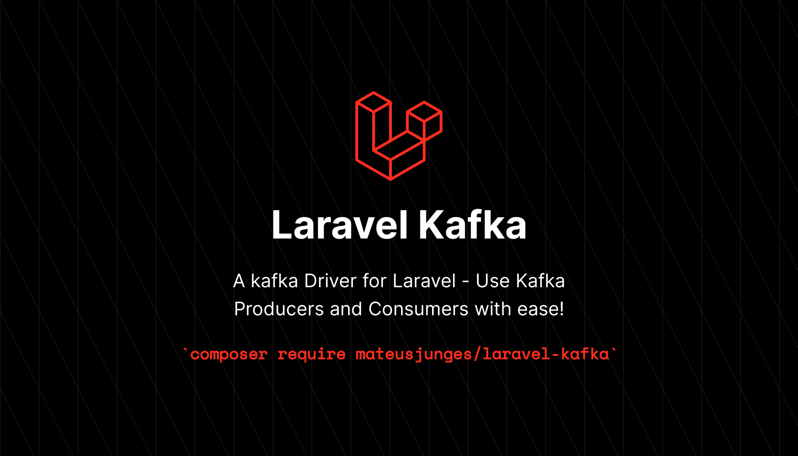

# Laravel Kafka

Do you use Kafka in your laravel projects? All packages I've seen until today, including some built by myself, does not provide a nice usage syntax or, if it does, the test process with these packages are very painful.

This package provides a nice way of producing and consuming kafka messages in your Laravel projects.

# Sponsor my work!
If you think this package helped you in any way, you can sponsor me on GitHub!

- My personal website: https://mateusjunges.com
- Follow me on Twitter: https://twitter.com/mateusjungess
- Follow me on Bluesky: https://bsky.app/profile/mateusjunges.com

# Documentation
You can [find the documentations for this package here](https://laravelkafka.com/)

# Testing
Run `composer test` to test this package.

# Contributing
Thank you for considering contributing for the Laravel Kafka package! The contribution guide can be found [here][contributing].

# Credits
- [Mateus Junges](https://twitter.com/mateusjungess)
- [Arquivei](https://github.com/arquivei)

# License
The Laravel Kafka package is open-sourced software licenced under the [MIT][mit] License. Please see the [License File][license] for more information.

[contributing]: .github/CONTRIBUTING.md
[license]: LICENSE
[mit]: https://opensource.org/licenses/MIT
